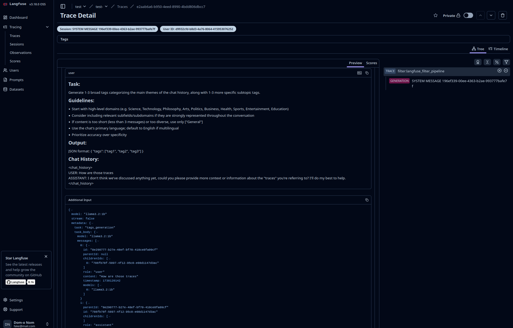

# Prototype of Deploying on Demand LLM Ready Infrastructure:
I know LLM's are cool and all, but you know whats not cool? Setting up the Infrastructure. Well look no further, here are some scripts and ways to deploy Containerized LLM's in a flash.

Please Review the Terraform Code before using it, currently using Bash Variables for Security.

## How it works.
1. We Have some `Terraform` code which will deploy an Ubuntu EC2 instance with a T4 GPU.
2. We have a script in `cfg` which currently only works on Debian based systems. This script will install Docker, Docker Compose, and necessary Drivers for utilizing NViDIA GPUs.
3. We have the application, which is hosted in Docker. Everything you need, Ollama API, Langfuse Tracing,  OpenWebUI, ChromaDB, and all the extras, all hosted in Docker. I would reccomend reviewing the Docker Compose to really adjust settings, and make it production ready, then all you need to do is run the `setup.sh` and you should be golden.

## Utilizing:
- [Langfuse](https://langfuse.com/self-hosting)
  - [OpenWebUI Langfuse Pipeline](https://github.com/open-webui/pipelines/blob/d4fca4c37c4b8603be7797245e749e9086f35130/examples/filters/langfuse_filter_pipeline.py)
- [OpenWebUI Github](https://github.com/open-webui/open-webui "User-friendly AI Interface for Ollama.").
- [ChromaDB Github](https://github.com/chroma-core/chroma "the AI-native open-source embedding database.").
- [Ollama Github](https://github.com/chroma-core/chroma "Get up and running with large language models.")
- Terraform
- Docker

### Example Trace: 

## Feel free to reach out, if any questions!
- I have a private API in progress, which will be a different repo when its ready.

